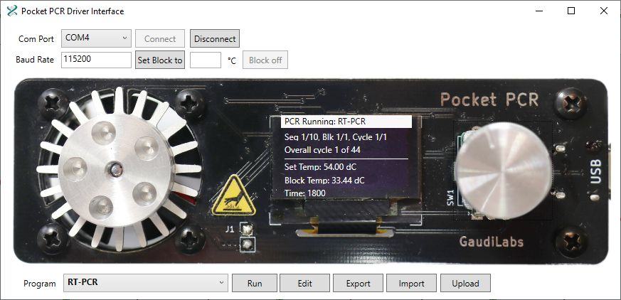
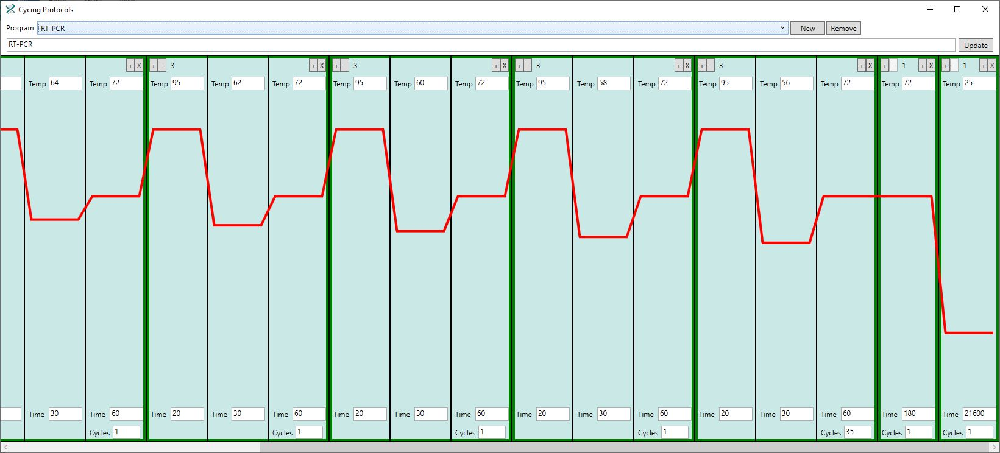

# PocketPCR_Programmable
Open-ended, programmable version of the open-source and open-hardware portable GaudiLabs USB-powered PocketPCR device with associated PC-side controller program to operate through a USB serial port.

%20%20%20

The GaudiLabs PocketPCR portable USB-powered thermalcycling device can be found at https://gaudi.ch/PocketPCR/
It is an open-source and open-hardware platform distributed under the GNU GENERAL PUBLIC LICENSE, Version 3, 29 June 2007.
Extensions to the platform found in this repository fall under the same license and any further modifications must be distributed with the same license.

The GaudiLabs PocketPCR device runs on a modified Adafruit Feather M0 board that can be programmed with the Arduino IDE, but a custom board specification must be loaded into the IDE (see below).

WARNING: The custom Adafruit Feather M0 device does not have a reset switch.  If code is uploaded to the board that renders it unrecognizable as a USB device, it will become unresponsive and unable to be flashed.  This is not a fatal condition, but is a little tricky.  Here is what must be done to reset the board:

-- With the device connected to the PC through USB, turn the board over to expose the microcontroller chip (may be labeled Atmel).  
-- Orient the board so that the USB port is on your left.
-- The microcontroller is the chip towards the top, just left of center of the device, with 12 connections on each of its four sides.
-- With the power on, a thin wire must be used to carefully connect the bottom connector on the right side of the chip to the fourth from the right connector along the top row of connectors.  This should be done twice in rapid succession until the computer recognizes the device.
-- Once the device is recognized again, the flashing procedure can be repeated.  
-- It is a good idea to get a clean version of either the original GaudiLabs "PocketPCR_V2_quite_dev_i_disp.ino" code or the unmodified "PocketPCR_Programmable.ino" to flash to the device and get it working again before trying to figure out what went wrong.

The original designs and device code for the PocketPCR can be found at https://github.com/GaudiLabs/PocketPCR.
To replace the limited programmability of the PocketPCR with an open-ended set of extensible programs that can be programmed and operated from a Windows computer:

1.  Install the Arduino controller IDE:  https://www.arduino.cc/en/guide/windows
2.  Download files in the PocketPCR_Programmable folder
3.  In the Arduino IDE, choose File->Preferences and add the following URL to "Additional Boards Manager URLs":
    https://adafruit.github.io/arduino-board-index/package_adafruit_index.json
4.  In the Arduino IDE, choose Tools->Board->Boards Manager
5.  Add "Adafruit SAMD Boards"
6.  From Tools->Board choose Adafruit SAMD (32-bits ARM Cortex-M0+ and Cortex-M4 Boards)->Adafruit Feather M0
7.  Some libraries will need to be added before the code can be updated on the PocketPCR board:
    a.  Choose Tools->Manage Libraries
    b. Make sure the following libraries are installed in your Arduino IDE:
        i.   Adafruit Bus IO
        ii.  Adafruit Circuit Playground
        iii. Adafruit GFX Library
        iv.  Adafruit SSD1306
        v.   EEPROM-Storage
        vi.  FlashStorage
8.  Open PocketPCR_Programmable.ino in the Arduino IDE and upload to the PocketPCR device
9.  Download the Visual Studio 2015 C# solution "PocketPCRController" and build it, or just download the PocketPCRController.exe executable from the PocketPCRController_Executable folder to run and program the reprogrammed PocketPCR device connected to your PC through a USB port.

Hyperlinked code documentation can be found in <a href="https://github.com/thalljiscience/PocketPCR_Programmable/tree/main/PocketPCRController/HTML_documentation.zip">HTML_documentation.zip.</a>  Just unzip all contents into one directory and load "index.html" into a web browser.
The same documentation can be found in pdf format in <a href="https://github.com/thalljiscience/PocketPCR_Programmable/tree/main/PocketPCRController/PocketPCRController.pdf">PocketPCRController.pdf.</a>

Email tomandhall@gmail.com with questions.
